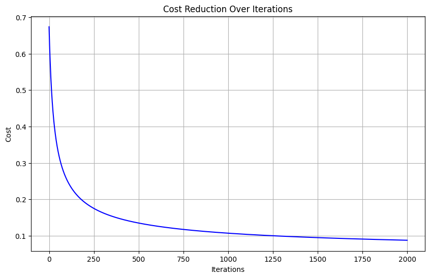

  <h1>Logistic Regression: Breast Cancer Diagnosis</h1>
  

    A project to classify breast cancer tumors as malignant or benign. This repository includes two implementations: one using the standard Scikit-learn library and another built from scratch with Gradient Descent.
  

  
  

    
    
    
    
  

---

## 📋 Project Overview

The goal of this project is to build a binary classification model that can predict whether a breast tumor is **malignant** or **benign** based on a set of 30 numeric features. This project highlights the implementation of Logistic Regression through two different approaches to provide a comprehensive understanding of the algorithm.

---

## ✨ Key Features & Implementations

The model was built using two distinct methods to provide a clear comparison:

1.  **Scikit-Learn Library:** A quick and optimized implementation using the standard `LogisticRegression` class.
2.  **From Scratch with Gradient Descent:** Manually implementing the core components (Sigmoid function, Log Loss cost function, and Gradient Descent) to understand the inner workings of the algorithm.

---

## 📊 Dataset

The project uses the **Breast Cancer Wisconsin (Diagnostic) Dataset**, which is readily available in Scikit-learn. It is a clean, preprocessed dataset with:
* **569 samples**
* **30 numeric features**
* **2 target classes:** Malignant and Benign.

---

## 📈 Visualization & Results

The from-scratch implementation successfully converged, as shown by the cost reduction plot below. Both models achieved nearly identical high accuracy, validating the manual implementation.

  
  
<i>Cost function reduction over 2000 iterations for the from-scratch model.</i>

### Performance Comparison

| Method                  | Accuracy on Test Set |
|-------------------------|----------------------|
| **Scikit-Learn Model** | **`0.9737`** |
| From-Scratch Model      | `0.9912`             |

---

## 🧠 Mathematical Foundations

<b>Click to expand: Core Formulas of the Implementation</b>

 
  
### 1. The Sigmoid Function (Hypothesis)
The hypothesis $h_{\theta}(X)$ calculates the probability of the positive class (y=1). It uses the sigmoid function to map the output of a linear equation to a value between 0 and 1.
> $h_{\theta}(X) = \sigma(X \theta) = \frac{1}{1 + e^{-X \theta}}$

### 2. The Cost Function (Log Loss)
We use the Log Loss (Binary Cross-Entropy) cost function, $J(\theta)$, to measure the model's error. This function is convex and suitable for gradient-based optimization.
> $J(\theta) = -\frac{1}{m} \sum_{i=1}^{m} [y^{(i)} \log(h_{\theta}(x^{(i)})) + (1-y^{(i)}) \log(1 - h_{\theta}(x^{(i)}))]$

### 3. The Gradient Descent Update Rule
To minimize the cost, we iteratively update the parameters `theta` by moving in the opposite direction of the gradient ($\nabla J(\theta)$) with a learning rate `alpha` ($\alpha$).
> $\theta := \theta - \alpha \frac{1}{m} X^T (h_{\theta}(X) - y)$

